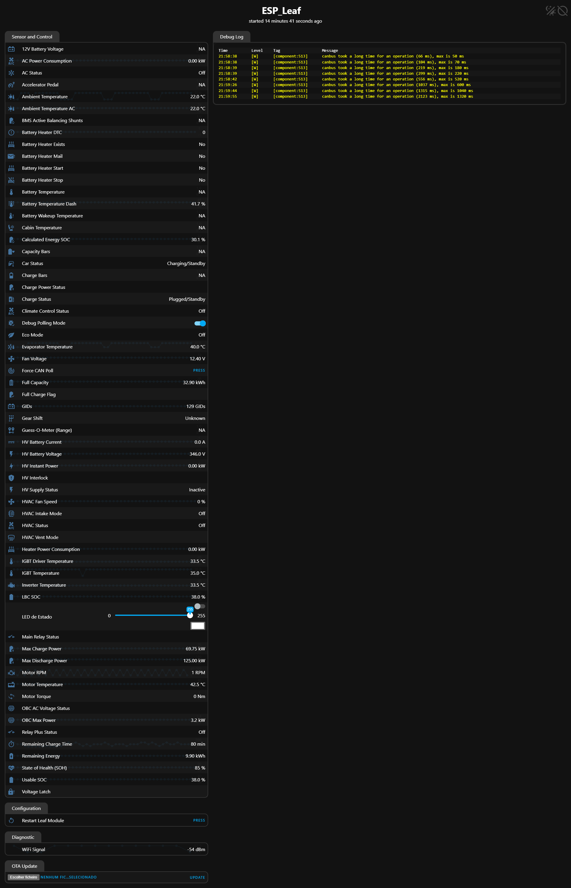
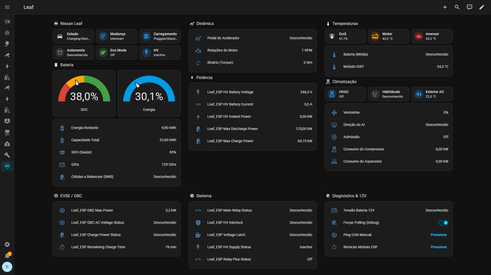

# 🍃 Nissan Leaf ZE1 - ESPHome CAN Monitor

A powerful, custom-built ESPHome integration to read, decode, and transmit real-time CAN bus data from a Nissan Leaf ZE1 (40kWh / 62kWh) directly to Home Assistant. 

This project uses an **ESP32-C3 SuperMini** paired with an **SN65HVD230** CAN transceiver to sniff the **EV-CAN** bus, providing deep telemetry without interfering with the vehicle's normal operation.

---

## ✨ Features & Engineering Highlights

This integration has been fine-tuned to solve several known quirks of the Nissan Leaf CAN bus:

* **🔋 Advanced Battery Telemetry:** Real-time monitoring of SOC, GIDs, SOH, High Voltage, Current, and Instant Power (kW).
* **🧠 BMS Smart Filtering:** The Leaf's `0x5BC` frame multiplexes the actual GIDs with the dashboard's max scale (500). This code includes a custom C++ state-machine to filter out the scale, providing a clean, bounce-free GIDs graph.
* **❄️ Climate Control Decoded:** Tracks HVAC status, vent modes, intake modes, compressor power, and PTC heater power. 
* **👻 Ghost Temperature Fix:** Prevents the infamous "55ºC Cabin Temperature" spike. The Leaf broadcasts `0x83` (131 decimal) when the climate unit is OFF. This code actively ignores placeholder bytes, keeping your graphs accurate.
* **🛡️ Smart Polling (12V Battery Protection):** Active polling for 12V battery stats is only triggered when the car is `ON`, `ACC`, or `Charging`. When the car sleeps, the ESP32 passively listens, preventing vampire drain on the 12V battery.

### 🌐 Web Fallback UI
Features a modern, standalone web server (ESPHome Web UI v3) to access real-time car data directly via the ESP's IP or Fallback Hotspot, even if Home Assistant is offline.

*(Example of the ESPHome Web UI displaying real-time data)*

---

## 🛒 Hardware Requirements

To build this project, you will need the following components. Here are the exact parts used in this build:

1. **Microcontroller:** [ESP32-C3 SuperMini](https://pt.aliexpress.com/item/1005009897797706.html)
2. **CAN Transceiver:** [SN65HVD230 (3.3V)](https://pt.aliexpress.com/item/1005006738154651.html)
3. **Connectors / Cables:** [OBD2 / J1939 Adapters](https://pt.aliexpress.com/item/1005006245122273.html)
4. **Power Supply:** [12V to 5V Step Down Converter](https://pt.aliexpress.com/item/1005006734943258.html) *(to power the ESP32 safely from the car's 12V line)*

---

## 🔌 Wiring & Schematic

The SN65HVD230 transceiver runs at 3.3V, making it perfectly safe for direct connection to the ESP32-C3.

| ESP32-C3 SuperMini | SN65HVD230 Transceiver |
| :--- | :--- |
| `3.3V` | `3V3` |
| `GND` | `GND` |
| `GPIO4` | `TX` |
| `GPIO3` | `RX` |

### Nissan Leaf EV-CAN Connection
To read traction battery and inverter data, you must connect to the **EV-CAN**. 
* **CAN-H:** Connect to EV-CAN High
* **CAN-L:** Connect to EV-CAN Low

> ⚠️ **Note on Odometer and TPMS:** The Nissan Leaf uses multiple CAN networks. The Odometer, Tire Pressures (TPMS), and door statuses reside on the **CAR-CAN**. Because this hardware is connected strictly to the **EV-CAN**, those specific sensors are out of scope for this firmware.

---

## 🚀 Installation

1. Flash the code to your ESP32-C3 using the ESPHome Dashboard.
2. In Home Assistant, navigate to **Settings > Devices & Services > ESPHome**, and your new `ESP_Leaf` node should be discovered automatically.
3. Open the `leafwifize1.yaml` file, copy everthing below `captive_portal:` and paste it below your existing config from ESPHome.
4. Install the module in your car.

---

## 📊 Home Assistant Dashboard

Want a beautiful interface right out of the box? I have designed a custom Lovelace dashboard layout using standard Home Assistant cards and [Mushroom Cards](https://github.com/piitaya/lovelace-mushroom) for a clean, modern look.

1. Ensure you have **Mushroom Cards** installed via HACS.
2. Create a new View in your Home Assistant Dashboard.
3. Edit the View in YAML mode and paste the contents of the `dashboard_layout.yaml` file (found in this repository).

*(Custom Home Assistant Dashboard for Nissan Leaf ZE1)*

---

## 🐛 Debugging & Manual Polling

This integration exposes a **Diagnostic & 12V** section in Home Assistant:
* **Force CAN Poll (Button):** Manually sends a wake-up frame and queries the VCM for immediate data updates.
* **Debug Polling Mode (Switch):** Overrides the Smart Polling safety feature. When toggled ON, the ESP32 will aggressively poll the CAN bus every 15 seconds, regardless of whether the car is ON or OFF. **Use only for temporary debugging to avoid draining your 12V battery!**

---

## 🙏 Credits & Acknowledgments

This project stands on the shoulders of giants within the open-source EV community:

* **[CrAzYDr1veR](https://github.com/CrAzYDr1veR):** A huge thanks for the original repository that served as the initial foundation and fork for this project.
* **[Dala the Great](https://github.com/dalathegreat):** The CAN bus decoding, formulas, and payload structures rely heavily on the extensive reverse-engineering work documented in his [leaf_can_bus_messages](https://github.com/dalathegreat/leaf_can_bus_messages) repository. 
* **Gareth:** For the excellent and detailed hardware documentation, which made wiring and integration safe and straightforward. Check out his full write-up here: [Notes on integrating a Nissan Leaf ZE1 and Home Assistant](https://blog.jingo.uk/notes-on-integrating-a-nissan-leaf-ze1-and-home-assistant/).

If you own a Leaf, be sure to check out their amazing work!

---
*Disclaimer: This project is for educational and diagnostic purposes. Connecting custom hardware to your vehicle's CAN bus carries inherent risks. I am not responsible for any damage to your vehicle, voided warranties, or drained 12V batteries.*
